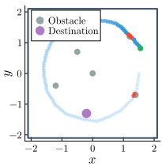

# State-space Transformation Shielding

Code for synthesis of nondeterministic safety-strategies (shields), as well as experiments showing the effect of applying these shields for reinforcement learning.

Shield synthesis builds upon [[1]](#1) but uses transformations of the state-space to be partitioned. Transformations are selected to better align the decision boundaries to the axes. Since partitions are axis-aligned, aligning the decision boundaries better with the axes minimizes over-approximation and allows for coarser partitions. This saves computation power and memory.

## Dependencies

This code has been developed on Ubuntu x86 versions 22.04 LTS and 24.04 LTS. The following installation instructions are given for this system. For other operating systems, consult the support pages of the tools mentioned.

Read and execute the commands carefully, substituting `<<>>` with appropriate values specific to your system. These instructions have not been tested on a clean install, so there may be errors in the commands.

### Install Python 3.12 and Create Venv

	sudo apt update
    sudo apt install python3.12

Create an empty venv and install the needed packages.

    cd <<path/to/this/repository>>/python
    python3.12 -m venv venv
    pip install -r requirements.txt

Activate the virtual environment to run code in this folder. Do this by

    cd <<path/to/this/repository>>/python
    source ./venv/bin/activate

### Install Julia 1.10.4 and Download Packages

	cd ~/Downloads
	wget https://julialang-s3.julialang.org/bin/linux/x64/1.10/julia-1.10.4-linux-x86_64.tar.gz
	tar zxvf julia-1.10.4-linux-x86_64.tar.gz
	mv julia-1.10.4/ ~/julia-1.10.4
	sudo ln -s ~/julia-1.10.4/bin/julia /usr/local/bin/julia

Be sure numpy is installed in your global python install, which is needed for Julia's PyCall. 

	sudo apt install python3-numpy

Alternatively, set `ENV["PYTHON"]` to the path/name of the python executable you want to use. Doing this requires re-building Pycall, which will be done in the next step. It is also done by running `Pkg.build("PyCall")`.

Download dependencies for this repository. Note that the `]` key activates the package manager interface. Once done, press backspace to exit the package manager, and type `exit()` to quit the REPL.

	cd <</path/to/this/repository>>
	julia --project=.
	] instantiate

> 🛈 <b id="starting_pluto"> **Starting Pluto Notebooks:**</b>
>
> To start the Pluto Notebook viewer/editor, use the following commands:
> 
>     cd <</path/to/this/repository>>
>	  julia --project=.
>	  using Pluto
>     Pluto.run()
> 
> This will open the main page in your default browser.
> To start a particular notebook, paste its absolute file path into the field labelled "Open a notebook".

### Install UPPAAL 5.0, and Activate License

If the following `wget` request is denied, please visit uppaal.org and follow download instructions.

	mkdir ~/opt
	cd ~/opt
	wget https://download.uppaal.org/uppaal-5.0/uppaal-5.0.0/uppaal-5.0.0-linux64.zip
	unzip uppaal-5.0.0-linux64.zip

Note that the code depends on the exact installation location of `~/opt/uppaal-5.0.0-linux64`.

Retrieve a license from https://uppaal.veriaal.dk/academic.html or alternatively visit uppaal.org for more info. Once you have your license, activate it by running

	~/opt/uppaal-5.0.0-linux64/bin/verifyta.sh --key <<YOUR-LICENSE-KEY>>

## Case Studies

Three case-studies are considered.
Note that the case-study refered here as "Spiral" may also be known as "Sattelite."

The safety (to be shielded) and optimality criteria of the case studies are given in the following table:

| | Bouncing Ball | Cart Pole | Spiral |
|---|---|---|---|
| **Safety:** | Ball must keep bouncing. | Pole must stay upright. | Must avoid obstacles. |
| **Optimality:** | Should minimize number of hits. | Should minimize the number of times cart leaves [-2.4; 2.4] interval. | Should maximise number of destinations visited. |
| **Illustration** |  |  |  |

In **Bouncing Ball** [[1]](#1), the player can try to either *hit* or *not hit* the ball each decision period. Hitting the ball only has an effect if it is above a certain height.

In **Cart Pole**, the player chooses to apply force either *left* or *right* each decision period.

In **Spiral**, the player can choose either *ahead*, *out* or *in* to change the radius of its trajectory.

## Repository Structure

### Shields

Code for shield synthesis is stored in the three folders whose name correspond to the case-studies: `Bouncing Ball/Bouncing Ball.jl`, `Cart Pole/Cart Pole.jl` and `Spiral/Spiral.jl`. 

The notebooks all share a color-theme from `Shared Code/FlatUI.jl`.

These files are interactive [Pluto Notebooks](https://plutojl.org/) written in [Julia](https://julialang.org/). For a quick introduction to the language's syntax, see [Learn X in Y Minutes where X=Julia](https://learnxinyminutes.com/docs/julia/). 

### Reinforcement Learning

The RL experiments are located in `python/experiments` which contain subfolders named after each case-study. These contain the corresponding UPPAAL-models, and the safety strategies which will be used. The main entry point of the system is `python/experiments/run_experiments.py`.

### Strategy Representation Size Reduction

Code for reducing the size of strategies is located in `python/trees`. This code is run as part of calling `python/experiments/run_experiments.py`.

## How to Run

Once all dependencies are installed, perform shielded reinforcement learning experiments by

    cd <<path/to/this/repository>>/python
    source ./venv/bin/activate
    python run_experiments.py

These experiments depend on shields which are generated in advance, and which are included in the repository for your convenience. To generate new ones, [start Pluto Notebooks](#starting_pluto) corresponding to the case study.
Pluto Notebooks feature interactive HTML inputs which are bound to specific variables.
Some of these inputs have to be modified manually to reproduce the shields.

In general, the resulting shields are exported in 3 different formats under the header **Exporting the Shield.** 
In particular, it is the Numpy format which will  be used in representation size reduction and reinforcement learning experiments.

The shields are saved to a temporary folder. On Ubuntu, (or any system with [Nautilus](https://apps.gnome.org/Nautilus/) installed) click the "Open Folder" button to view the contents of the `target_dir` which contains the results. 
On other systems, copy or modify the path in `target_dir`.

### Bouncing Ball

After the notebook has finished executing, hit the button labelled "Make UPPAAL-friendly." Then find the results  as stated above.

To get a shield in the original state-space, run a different notebook provided in the [GridShielding](https://github.com/AsgerHB/GridShielding.jl) package. Run the notebook at https://github.com/AsgerHB/GridShielding.jl/blob/main/notebooks/BBExample.jl .

### Cart Pole

To get the polynomial for the altered state-space: Make sure `enable_altered_state_space` is set to false. (This is the default.)
Set the input bound to `max_steps` in the section **Mainmatter** to 3. Go to the section **Fit a Polynomial** in the table of contents.
Observe the values of the polynomial printed under one of the notebook cells.
Observe that these match the values used in the function `P2(θ, θ_vel)` in the section **Altered State Space**.

To get the shield in the transformed state-space: Now set `enable_altered_state_space` to true, and `max_steps` to a sufficiently high value (e.g. 1000).

To get the shield in the standard state-space: Untick `enable_altered_state_space` again. Set the resolution in **🛠 resolution** to 20, 20, 30, 30.

> 🛈 Note that the first two inputs are ignored. These control the granularity of the position and velocity of the cart, as oppsed to the angle and angular velocity. It is possible to synthesize a shield for the position instead, in which case the first two inputs of the resolution are used. Do this by setting **🛠 safety constraints**. It has not been possible to synthesize a shield that maintains both position and angle. Finding a state-space transformation that allows doing this with a feasible resolution is future work.

### Spiral

I'm especially proud of the animations in this one. Hit the button labelled "Make UPPAAL-frinedly" to ensure the shield is also safe in the imprecise simulations of UPPAAL SMC.

## References
<a id="1">[1]</a> 
A. H. Brorholt, P. G. Jensen, K. G. Larsen, F. Lorber, and C. Schilling, 
["Shielded Reinforcement Learning for Hybrid Systems"](https://arxiv.org/abs/2308.14424), 
in Bridging the Gap Between AI and Reality, B. Steffen, Ed., in Lecture Notes in Computer Science. Cham: Springer Nature Switzerland, 2024, pp. 33-54. 
doi: 10.1007/978-3-031-46002-9_3.